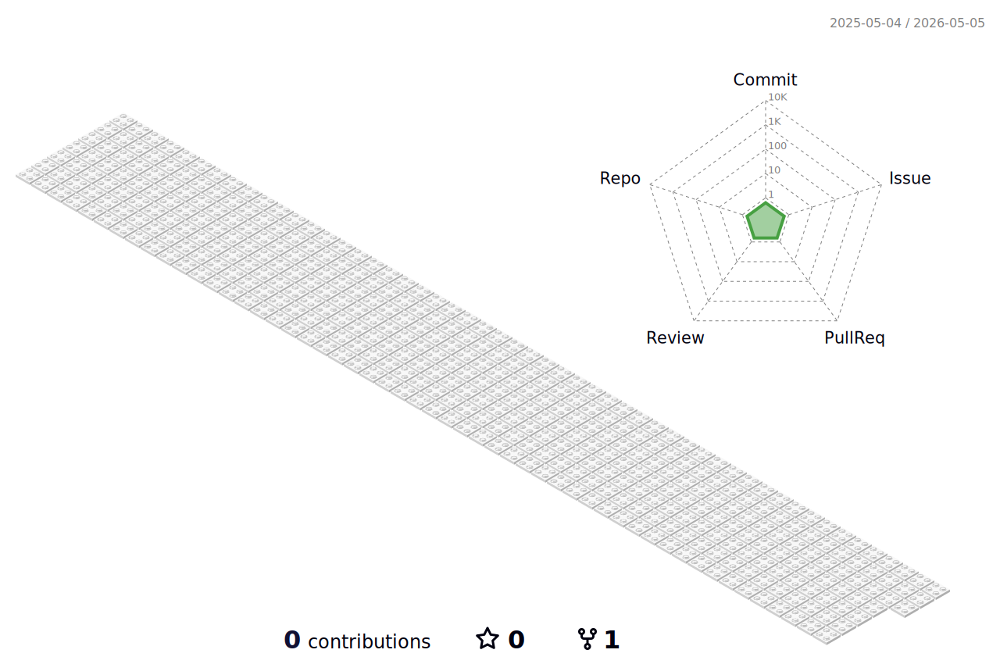

# 💫 About Me:
🔭 I’m currently working on TeleSynergy 👯 I’m looking to collaborate on full stack projects 🌱 I’m currently learning Data Structures and Algorithms 💬 Ask me about engineering  

## 🌐 Socials:
   

# 💻 Tech Stack:
                                
# 📊 GitHub Stats:
 
 

## 🏆 GitHub Trophies

### ✍️ Random Dev Quote

### 🔝 Top Contributed Repo

### 😂 Random Dev Meme

---

<!-- Proudly created with GPRM ( https://gprm.itsvg.in ) -->
